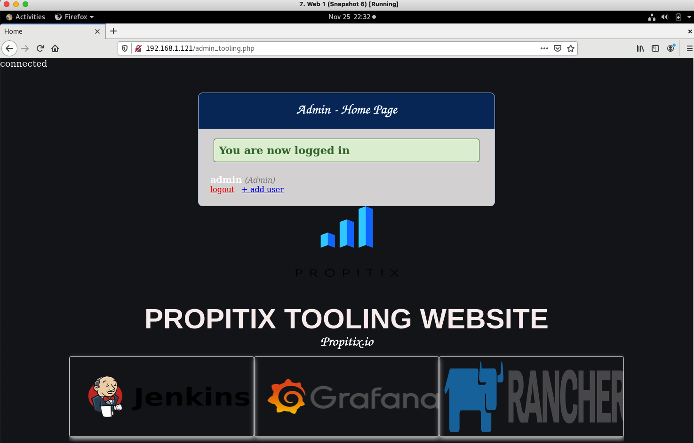

<h1 align="center">Welcome to Devops Tooling Website Solution 👋</h1>

  

> As a member oof a DevOps team, I will implement a tooling website solution which makes access to DevOps tools within corporate infrastructure easily accessible. Click on the link below to see the project notes.

[Project Notes](devops-tooling-website-solution.md)

### 🏠 [Homepage](https://github.com/dinulhaque/devopstooling)

## Author

👤 **Dinul Haque**

* Website: https://github.com/dinulhaque
* Github: [@dinulhaque](https://github.com/dinulhaque)
* LinkedIn: [Dinul Haque](https://www.linkedin.com/in/dinul-haque-aws-linux-sysadmin/)

## Show your support

Give a ⭐️ if this project helped you!

***
