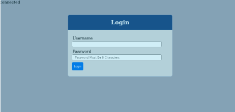

# Devops Tooling Website Solution

In this Project I will demonstrate how to set up NFS shared folders to 3 Apache Apache Web Servers.

This will be done provide a Devops Tooling Website Solution.

The NFS shared folders will store httpd logs and var/www/ contents to the NFS server.

This project is hosted using Virtual Box.

The aim of this project is to understand how NFS servers can help store logs and certain other shared folders in one location.

More information regarding the benefits of NFS with DevOps environment will be added in the near future.

         **Network Info:**

1. NFS Server     192.168.1.108
2. Web Server1  192.168.1.121
3. Web Server2 192.168.1.113
4. Web Server3 192.168.1.108
5. MariaD           192.168.1.120

---

### Setup NFS Server

Installing NFS Server

```bash
dnf install nfs-utils
```

Created mount points on /mnt directory for the logical volumes as follows

- Mount lv-apps on /mnt/html - To be used by webservers
- Mount lv-logs on /mnt/logs - To be used by webserver logs
- Mount lv-opt on /mnt/opt - To be used by Jenkins server in Project 8

Added the LVM to a Volume Group called nfs-vg and added the above lvm's to the volume group.

e.g.

```bash
lvcreate -n lv-apps --size 1020M nfs-vg
```

I have formatted the disks as xfs using mkfs.xfs command, providing read and write permission

Created /var/www directory and mounted it to /mnt/html directory.

```bash
chmod a+rwx /mnt/html/
chmod a+rwx /mnt/logs/
chmod a+rwx /mnt/opt/

mount /dev/nfs-vg/lv-html /var/www/
```

Adding mount information to fstab file to allow persistence on system reboot.

```bash
nano etc/fstab
```

```bash
/dev/nfs-vg/lv-opt    /mnt/opt                xfs     defaults        0 0
/dev/nfs-vg/lv-apps   /mnt/html               xfs     defaults        0 0
/dev/nfs-vg/lv-logs   /mnt/logs               xfs     defaults        0 0
```

Checking the mount.

```bash
df -h

Output:

Filesystem Size Used Avail Use% Mounted on
devtmpfs 887M 0 887M 0% /dev
tmpfs 914M 0 914M 0% /dev/shm
tmpfs 914M 9.6M 904M 2% /run
tmpfs 914M 0 914M 0% /sys/fs/cgroup
/dev/sda2 236G 5.9G 230G 3% /
/dev/mapper/nfs--vg-lv--opt 1014M 40M 975M 4% /mnt/opt
/dev/mapper/nfs--vg-lv--logs 1014M 40M 975M 4% /mnt/logs
/dev/mapper/nfs--vg-lv--apps 1014M 40M 975M 4% /mnt/html
/dev/sda5 254G 2.1G 252G 1% /home
/dev/sda1 976M 264M 646M 29% /boot
tmpfs 183M 1.2M 182M 1% /run/user/42
tmpfs 183M 4.6M 179M 3% /run/user/1000
```

Enabling nfs service

```bash
$ sudo systemctl start nfs-server.service
$ sudo systemctl enable nfs-server.service
```

The configuration files for the NFS server are:

- **/etc/nfs.conf** – main configuration file for the NFS daemons and tools.
- **/etc/nfsmount.conf** – an NFS mount configuration file.

To export the above file system, run the exportfs command with the -a flag means export or unexport all directories, -r means reexport all directories, synchronizing /var/lib/nfs/etab with /etc/exports and files under /etc/exports.d, and -v enables verbose output.

Edit the /etc/exports to allow the NFS for remote servers

```bash
nano /etc/exports
```

Save the file with the following text

```bash
/mnt 192.168.1.0/24 (rw,sync,no_root_squash)
/mnt/opt 192.168.1.0/24 (rw,sync,no_root_squash)
/mnt/html 192.168.1.0/24 (rw,sync,no_root_squash)
/mnt/logs 192.168.1.0/24 (rw,sync,no_root_squash)
```

Export NFS shares

```bash
exportfs -arv
exporting 192.168.1.0/24:/mnt/logs
exporting 192.168.1.0/24:/mnt/html
exporting 192.168.1.0/24:/mnt/opt
exporting 192.168.1.0/24:/mnt
exporting *:/mnt/logs
exporting *:/mnt/html
exporting *:/mnt/opt
exporting *:/mnt
```

Next, i have the **firewalld** service running, I need to allow traffic to the necessary NFS services (**mountd**, **nfs**, **rpc-bind**) via the firewall, then reload the firewall rules to apply the changes, as follows.

```bash
firewall-cmd --permanent --add-service=nfs
firewall-cmd --permanent --add-service=rpc-bind
firewall-cmd --permanent --add-service=mountd
firewall-cmd --permanent --add-source=192.168.1.0/24
firewall-cmd --reload
```

---

### Step 2 — Configure the database server

Install Mariadb

```bash
sudo apt update
sudo apt install mariadb-server -y
sudo mysql_secure_installation
```

configure database for mariadb, login as root

```bash
mariadb
```

Accepting the default value to set up.

Create database

```bash
CREATE DATABASE tooling;
```

Creating user account

```bash
CREATE USER 'webaccess'@'192.168.1.%' IDENTIFIED BY 'November2020!';
```

Grant permission to webaccess user on tooling database to do anything only from the webservers subnet cidr

```bash
GRANT ALL PRIVILEGES ON tooling.* TO 'webaccess'@'192.168.1.%' IDENTIFIED BY 'November2020!' WITH GRANT OPTION;
```

```bash
FLUSH PRIVILEGES;
```

Verify database:

```bash
SELECT User, Host FROM mysql.user WHERE Host <> 'localhost';
```

```bash
Output:

+-----------+-------------+
| User      | Host        |
+-----------+-------------+
| webaccess | 192.168.1.% |
+-----------+-------------+
1 row in set (0.000 sec)
```

To exit I pressed CTRL+C

Amend the bind config from file /etc/mysql/mariadb.conf.d/50-server.cnf

```bash
nano /etc/mysql/mariadb.conf.d/50-server.cnf
```

```bash
bind-address            = 0.0.0.0
```

Enable and start service

```bash
sudo systemctl enable mariadb.service
systemctl start mariadb.service
```

Whitelist known IP subnet range to allow traffic

```bash
sudo ufw allow from 192.168.1.0/24
```

UFW Allow HTTP

```bash
sudo ufw allow http
```

UFW Allow HTTPS

```bash
sudo ufw allow https
```

Allow SQL connection from known subnet range

```bash
sudo ufw allow from 192.168.1.0/24 to any port 3306
```

Enable Firewall

```bash
ufw enable

Output:
Firewall is active and enabled on system startup
```

Checking UFW status

```bash
root@dinul:~# ufw status
Status: active

To                         Action      From
--                         ------      ----
Anywhere                   ALLOW       192.168.1.0/24            
80/tcp                     ALLOW       Anywhere                  
443/tcp                    ALLOW       Anywhere                  
3306                       ALLOW       192.168.1.0/24            
80/tcp (v6)                ALLOW       Anywhere (v6)             
443/tcp (v6)               ALLOW       Anywhere (v6)
```

I now need to get GIT installed to get the sql dump file to import.

Installing git

```bash
sudo apt install git -y
```

Clone repo for Tooling to the /tmp folder

```bash
git clone https://github.com/dinulhaque/tooling.git /tmp/tooling

```

Import sql dump file

```bash
mysql -u webaccess  -h 192.168.1.120 -p tooling  < /tmp/tooling/tooling-db.sql
```

---

### **Step 3 — Prepare the Web Servers**

```bash
dnf install nfs-utils nfs4-acl-tools -y
```

Whitelist NFS and MariaDB server IP

```bash
firewall-cmd --permanent --add-source=192.168.1.0/24

```

Reload Firewall

```bash
sudo firewall-cmd --reload
```

Showmount command to show mount information for the NFS Server.

```bash
showmount -e 192.168.1.112

#output:

/mnt/logs (everyone)
/mnt/html (everyone)
/mnt/opt  (everyone)
/mnt      (everyone)
```

I am now going to mount /var/www/ and target the NFS server's export for apps and providing read write permission

```bash
mkdir -p /var/www
chmod a+rwx /var/www/
mount -t nfs 192.168.1.112:/mnt/html /var/www

```

To confirm the remote file system has been mounted. 

```bash
mount | grep nfs
```

Output:

```bash
sunrpc on /var/lib/nfs/rpc_pipefs type rpc_pipefs (rw,relatime)
192.168.1.112:/mnt/html on /var/www type nfs4 (rw,relatime,vers=4.2,rsize=262144,wsize=262144,namlen=255,hard,proto=tcp,timeo=600,retrans=2,sec=sys,clientaddr=192.168.1.121,local_lock=none,addr=192.168.1.112)
```

Enable mount to be persistent

```bash
nano /etc/fstab
```

```bash
#pasted the following value in the file
echo "192.168.1.112:/mnt/html                  /var/www	          nfs     defaults        0 0" >> /etc/fstab
```

### Install Apache and php

```bash
sudo dnf install httpd php php-mysqlnd
```

Installing Mariadb and start

```bash
dnf install mariadb-server -y
sudo systemctl start mariadb 
```

Configure Apache server contents over HTTP/S, mysql and open port 443 by enabling the https service:

```bash
sudo firewall-cmd --permanent --add-service=https
sudo firewall-cmd --permanent --add-service=http
sudo firewall-cmd --permanent --add-service=mysql
```

Reload the firewall to apply the changes.

```bash
sudo firewall-cmd --reload
```

Start the Apache server

```bash
sudo systemctl start httpd
```

Verify status

```bash
sudo systemctl status httpd

output:

● httpd.service - The Apache HTTP Server
   Loaded: loaded (/usr/lib/systemd/system/httpd.service; disabled; vendor pres>
  Drop-In: /usr/lib/systemd/system/httpd.service.d
           └─php-fpm.conf
   Active: active (running) since Tue 2020-11-24 12:06:07 EST; 6s ago
     Docs: man:httpd.service(8)
 Main PID: 5200 (httpd)
   Status: "Started, listening on: port 80"
    Tasks: 213 (limit: 11344)
   Memory: 22.4M
   CGroup: /system.slice/httpd.service
           ├─5200 /usr/sbin/httpd -DFOREGROUND
           ├─5207 /usr/sbin/httpd -DFOREGROUND
           ├─5208 /usr/sbin/httpd -DFOREGROUND
           ├─5209 /usr/sbin/httpd -DFOREGROUND
           └─5210 /usr/sbin/httpd -DFOREGROUND

Nov 24 12:06:06 osboxes systemd[1]: Starting The Apache HTTP Server...
Nov 24 12:06:07 osboxes systemd[1]: Started The Apache HTTP Server.
Nov 24 12:06:08 osboxes httpd[5200]: Server configured, listening on: port 80
```

Check mount on Webserver

```bash
df -h
```

```bash
[root@osboxes html]# df -h
Filesystem               Size  Used Avail Use% Mounted on
devtmpfs                 887M     0  887M   0% /dev
tmpfs                    914M     0  914M   0% /dev/shm
tmpfs                    914M  9.6M  904M   2% /run
tmpfs                    914M     0  914M   0% /sys/fs/cgroup
/dev/sda2                236G  6.3G  230G   3% /
/dev/sda5                254G  2.0G  252G   1% /home
/dev/sda1                976M  263M  646M  29% /boot
tmpfs                    183M  1.2M  182M   1% /run/user/42
tmpfs                    183M  4.6M  179M   3% /run/user/1000
/dev/sr0                  59M   59M     0 100% /run/media/osboxes/VBox_GAs_6.1.17
192.168.1.112:/mnt/html 1014M   40M  975M   4% /var/www
```

Mounting httpd log to /mnt/logs

```bash
mount -t nfs 192.168.1.112:/mnt/logs /var/log/httpd
```

Installing git

```bash
sudo dnf install git -y
```

Clone repo for Tooling to the /tmp folder

```bash
git clone https://github.com/dinulhaque/tooling.git /tmp/tooling
```

copying /tmp/tooling/html folder contents to /var/www/html

```bash
cp -R /tmp/tooling/html /var/www/html
```

 Showing /var/www/html folder contents:

```bash
ls -ltr /var/www/html/
total 40
-rwxr-xr-x. 1 apache apache 2964 Nov 20 21:54 admin_tooling.php
-rwxr-xr-x. 1 apache apache 1531 Nov 20 21:54 create_user.php
-rwxr-xr-x. 1 apache apache 4353 Nov 20 21:54 functions.php
drwxr-xr-x. 2 apache apache  183 Nov 20 21:54 img
-rwxr-xr-x. 1 apache apache 3217 Nov 20 21:54 index.php
-rwxr-xr-x. 1 apache apache  781 Nov 20 21:54 login.php
-rwxr-xr-x. 1 apache apache   19 Nov 20 21:54 README.md
-rwxr-xr-x. 1 apache apache 1097 Nov 20 21:54 register.php
-rwxr-xr-x. 1 apache apache 1704 Nov 20 21:54 style.css
-rwxr-xr-x. 1 apache apache 1027 Nov 20 21:54 tooling_stylesheets.css
```

Changing folder permission and chmod permission

```bash
sudo chown -R apache:apache /var/www/
chmod 770 -R /var/www
```

Amending httpd.conf to pick up the index.php files rather than index.html

```bash
													#/etc/httpd/conf/httpd.conf
#Added in index.php before index.html

<IfModule dir_module>
    DirectoryIndex index.php index.html
</IfModule>

```

Configured db settings on functions.php file

```bash
nano /var/www/html/functions.php
```

following information inserted in the file.

```bash
$db = mysqli_connect('192.168.1.120', 'webaccess', 'November2020!', 'tooling');
```

Saved and exit the file

I am now going to mount /mnt/logs with /etc/httpd/logs

```bash
mount -t nfs 192.168.1.112:/mnt/logs /var/log/httpd/
```

I add the mount information to /etc/fstab

```bash
192.168.1.112:/mnt/logs                  /var/log/httpd    nfs            defaults        0 0
```

To confirm the remote file system has been mounted. 

```bash
mount | grep nfs
```

Output:

```bash
sunrpc on /var/lib/nfs/rpc_pipefs type rpc_pipefs (rw,relatime)
192.168.1.112:/mnt/html on /var/www type nfs4 (rw,relatime,vers=4.2,rsize=262144,wsize=262144,namlen=255,hard,proto=tcp,timeo=600,retrans=2,sec=sys,clientaddr=192.168.1.121,local_lock=none,addr=192.168.1.112)
192.168.1.112:/mnt/logs on /var/log/httpd type nfs4 (rw,relatime,vers=4.2,rsize=262144,wsize=262144,namlen=255,hard,proto=tcp,timeo=600,retrans=2,sec=sys,clientaddr=192.168.1.121,local_lock=none,addr=192.168.1.112)
```

Persist the mount on reboot:

```bash
echo "192.168.1.112:/mnt/logs    /etc/httpd/logs/  nfs     defaults 0 0">>/etc/fstab
```

Restarted Mariadb service and httpd

Connecting to remote sql:

```bash
mysql -u webaccess -h 192.168.1.120 -p'November2020!'
```

Output

```bash
[root@osboxes /]# mysql -u webaccess -h 192.168.1.120 -p'November2020!'
Welcome to the MariaDB monitor.  Commands end with ; or \g.
Your MariaDB connection id is 44
Server version: 10.3.25-MariaDB-0ubuntu0.20.04.1 Ubuntu 20.04

Copyright (c) 2000, 2018, Oracle, MariaDB Corporation Ab and others.

Type 'help;' or '\h' for help. Type '\c' to clear the current input statement.

MariaDB [(none)]> SHOW Databases;
+--------------------+
| Database           |
+--------------------+
| information_schema |
| tooling            |
+--------------------+
2 rows in set (0.001 sec)
```

Testing the browser on http://192.168.1.121



When I tried to login using admin as username and admin as password I was getting the following message. 'Please match the requested format'


To resolve this issue I had to amend the functions.php file and change the minimum character limit.

```bash
nano /var/www/html/login.php
```

> <input type="password" name="password" pattern=".{8,16}" placeholder=" Password Must Be 8 Characters" >

Pasted the following code as a replacement. Changing the password minimum character limit to 4.

```bash
<input type="password" name="password" pattern=".{4,16}" placeholder=" Password Must Be 8 Characters" >
```

Restarted httpd service and I can see the result as logged in.


I have the same results for the remaining 2 web servers.


Credits

[How to Set Up NFS Server and Client on CentOS 8](https://www.tecmint.com/install-nfs-server-on-centos-8/)

[Configuring MariaDB for Remote Client Access](https://mariadb.com/kb/en/configuring-mariadb-for-remote-client-access/)

[DevOps Career And Mentorship Experts - Darey.io](https://darey.io/)